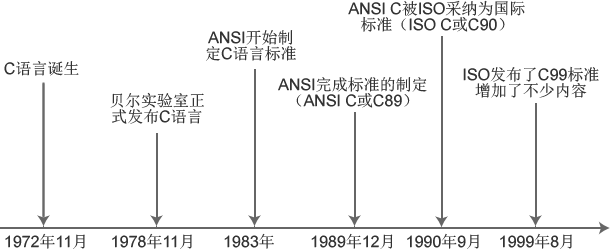

# C语言的历史

如果您之前未接触任何编程语言，或者您不理解为什么学习C语言，请查看：[为什么C语言是首选](http://c.biancheng.net/cpp/html/1139.html)。

 C语言于1972年11月问世，1978年美国电话电报公司（AT&T）贝尔实验室正式发布C语言，1983年由美国国家标准局（American National Standards  Institute，简称ANSI）开始制定C语言标准，于1989年12月完成，并在1990年春天发布，称之为ANSI C，有时也被称为 C89 或 C90。

 在学习C语言之前，我们先了解一下C语言的历史。

 C语言是一门通用的，模块化，程序化的编程语言，被广泛应用于操作系统和应用软件的开发。由于其高效和可移植性，适应于不同硬件和软件平台，深受开发员的青睐。

## C语言早期发展

1969-1973年在美国电话电报公司（AT&T）贝尔实验室开始了C语言的最初研发。根据C语言的发明者丹尼斯·里奇 (Dennis Ritchie) 说，C 语言最重要的研发时期是在1972年。

 说明：丹尼斯·里奇(Dennis Ritchie)，C语言之父，UNIX之父。1978年与布莱恩·科尔尼干(Brian  Kernighan)一起出版了名著《C程序设计语言(The C Programming  Language)》，现在此书已翻译成多种语言，成为C语言方面最权威的教材之一。2011年10月12日（北京时间为10月13日），丹尼斯·里奇去世，享年70岁。

 C语言之所以命名为C，是因为C语言源自Ken Thompson发明的 B语言，而B语言则源自BCPL语言。

 C语言的诞生是和UNIX操作系统的开发密不可分的，原先的UNIX操作系统都是用汇编语言写的，1973年UNIX操作系统的核心用C语言改写，从此以后，C语言成为编写操作系统的主要语言。

## K&R C

1978年，丹尼斯·里奇(Dennis Ritchie)和布莱恩·科尔尼干(Brian Kernighan)出版了一本书，名叫《The C  Programming  Language》（中文译名为《C程序设计语言》）。这本书被C语言开发者们称为“K&R”，很多年来被当作C语言的非正式的标准说明。人们称这个版本的C语言为“K&R C”。

 1988年丹尼斯·里奇(Dennis Ritchie)和布莱恩·科尔尼干(Brian Kernighan)修改此书，出版了《The C Programming Language》第二版，第二版涵盖了ANSI C语言标准。第二版从此成为大学计算机教育有关C语言的经典教材，多年后也没再出现过更好的版本。

## ANSI C 和 ISO C

1970到80年代，C语言被广泛应用，从大型主机到小型微机，也衍生了C语言的很多不同版本。

 为统一C语言版本，1983年美国国家标准局（American National Standards  Institute，简称ANSI）成立了一个委员会，来制定C语言标准。1989年C语言标准被批准，被称为ANSI X3.159-1989  "Programming Language C"。这个版本的C语言标准通常被称为ANSI C。又由于这个版本是 89 年完成制定的，因此也被称为 C89。

 后来 ANSI 把这个标准提交到 ISO（国际化标准组织），1990年被 ISO 采纳为国际标准，称为 ISO C。又因为这个版本是1990年发布的，因此也被称为C90。

 ANSI C(C89) 与 ISO C(C90)内容基本相同，主要是格式组织不一样。

 因为 ANSI 与 ISO 的C标准内容基本相同，所以对于C标准，可以称为ANSI C，也可以说是ISO C，或者 ANSI / ISO C。

注意：以后大家看到 ANSI C、ISO C、C89、C90，要知道这些标准的内容都是一样的。

目前，几乎所有的开发工具都支持 ANSI / ISO C 标准。是C语言用得最广泛的一个标准版本。

## C99

在ANSI C标准确立之后，C语言的规范在很长一段时间内都没有大的变动。1995年C程序设计语言工作组对 C语言进行了一些修改，成为后来的1999年发布的 ISO/IEC 9899:1999标准，通常被成为C99。

 但是各个公司对C99的支持所表现出来的兴趣不同。当GCC和其它一些商业编译器支持C99的大部分特性的時候，微软和Borland却似乎对此不感兴趣。

 说明：GCC（GNU Compiler Collection，GNU编译器集合）是一套由GNU工程开发的支持多种编程语言的编译器。

综上所述，目前广泛使用的C语言版本是 ANSI / ISO C，最经典的C语言教材是《C程序设计语言(The C Programming Language) 第二版》。

 C语言版本更迭史

## C语言对其它语言的影响

很多编程语言都深受C语言的影响，比如C++（原先是C语言的一个扩展）、C#、Java、PHP、Javascript、Perl、LPC和UNIX的C Shell等。

也正因为C语言的影响力，掌握C语言的人，再学其它编程语言，大多能很快上手，触类旁通，很多大学将C语言作为计算机教学的入门语言。

## C语言版本更迭

| 年份      | C标准                          | 通用名 | 别名               | 标准编译选项                           | GNU扩展选项 |
| --------- | ------------------------------ | ------ | ------------------ | -------------------------------------- | ----------- |
| 1972      | Birth C                        | -      | -                  | -                                      | -           |
| 1978      | K&R C                          | -      | -                  | -                                      | -           |
| 1989-1990 | X3.159-1989, ISO/IEC 9899:1990 | C89    | C90, ANSI C, ISO C | -ansi`, `-std=c90`, `-std=iso9899:1990 | -std=gnu90  |
| 1995      | ISO/IEC 9899/AMD1:1995         | AMD1   | C94, C95           | -std=iso9899:199409                    | -           |
| 1999      | ISO/IEC 9899:1999              | C99    | -                  | -std=c99`, `-std=iso9899:1999          | -std=gnu99  |
| 2011      | ISO/IEC 9899:2011              | C11    | -                  | -std=c11`, `-std=iso9899:2011          | -std=gnu11  |
| 2018      | ISO/IEC 9899:2018              | C18    | -                  | -std=c18`, `-std=iso9899:2018          | -std=gnu18  |

## C++版本更迭

| 年份 | C++标准            | 通用名 | 别名  | 标准编译选项           | GNU扩展选项                |
| ---- | ------------------ | ------ | ----- | ---------------------- | -------------------------- |
| 1978 | C with Classes     | -      | -     | -                      | -                          |
| 1998 | ISO/IEC 14882:1998 | C++98  | -     | -std=c++98             | -std=gnu++98               |
| 2003 | ISO/IEC 14882:2003 | C++03  | -     | -std=c++03             | -std=gnu++03               |
| 2011 | ISO/IEC 14882:2011 | C++11  | C++0x | std=c++11`, `std=c++0x | std=gnu++11`, `std=gnu++0x |
| 2014 | ISO/IEC 14882:2014 | C++14  | C++1y | std=c++14`, `std=c++1y | std=gnu++14`, `std=gnu++1y |
| 2017 | ISO/IEC 14882:2017 | C++17  | C++1z | std=c++17`, `std=c++1z | std=gnu++17`, `std=gnu++1z |
| 2020 | to be determined   | C++20  | C++2a | -std=c++2a             | std=gnu++2a                |

### gcc/g++

1. gcc发展到今天已经不单单可以编译C语言了，还可以编译C++、Java、Object-C等多种其他语言
2. 一种说法是GCC的全名是GNU Compiler Collection(GUN 编译器集合)，而gcc是GCC中用于编译c语言的编译器
3. 事实上，gcc看起来并不像是一个编译器，而像一个调度器，针对于不同的文件调用不同编程语言的编译器
4. 对于后缀为*.c的文件，gcc把它当作是C语言程序源代码，而g++当作是C++程序源代码*
5. 对于后缀为*.cpp的文件，gcc和g++都会当作是C++程序源代码*
6. 使用g++编译文件时，g++会自动链接标准库STL，而gcc不会自动链接STL，所以再使用gcc编译C++程序是有时会报错
7. 在用gcc编译C++文件时，为了能够使用STL，需要加参数 –lstdc++ ，但这并不代表 gcc –lstdc++ 和 g++等价，据说g++会调用gcc，对于C++代码，因为gcc命令不能自动和C++程序使用的库联接，所以通常用g++来完成链接
8. 需要注意的是，虽说g++会调用gcc，对于*.c文件来说，编译出来的可执行文件也不一样，因为gcc会当成C语言程序编译，而g++调用的gcc会把它当做C++语言程序来编译，这或许就能解释为什么用g++就可以编译所有C/C++的程序，还要有gcc的存在（就我测试来看，同样的C语言代码，g++编译出来的程序体积要大一些）
   

2021-11-25 14:17:59 -- 2021-11-25 14:18:00

[C/C++版本更迭历程](https://blog.csdn.net/albertsh/article/details/89192242)